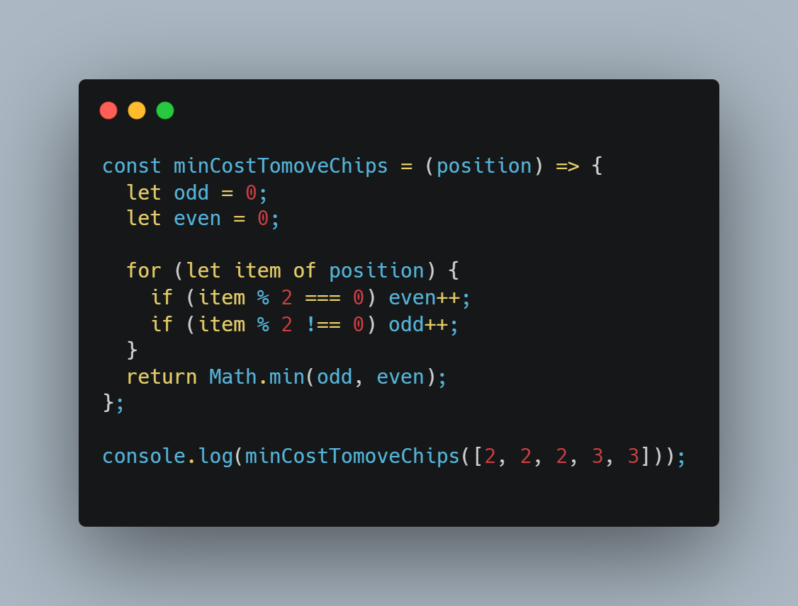

Repository contains Dynamic Programming Problems regarding ................

> > > > Recursion and Iteration
> > > > Clear understanding of use of For Loop (iteration) && while loop
> > > > Binary Tree
> > > > Array and String
> > > > DFS as well as BFS
> > > > 2D Array Or Graph
> > > > Fibonnaci
